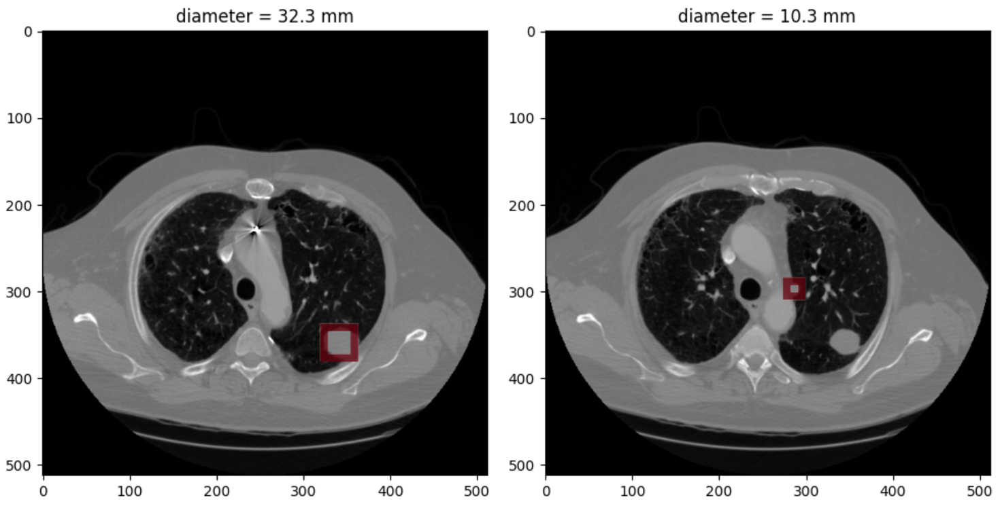
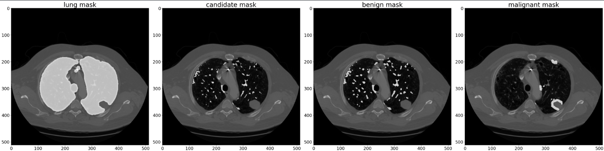

# Lung CT 3D Nodule Detection and Classification

This project focuses on analyzing 3D lung CT scan data to detect pulmonary nodules and classify them as benign or malignant using deep learning techniques.

---

##  Project Pipeline

This project follows a structured 3D CT analysis pipeline, consisting of the following steps:

### 1. **Data Loading**
- Load `.mhd` / `.raw` CT volumes from `subset0 ~ subset9` (LUNA16 format).
- Load `annotations.csv` and `candidates.csv` to retrieve:
  - `series_uid`, `is_nodule`, and nodule coordinates (`z, y, x`).

### 2. **Preprocessing**
- **HU Clipping**: Apply Hounsfield Unit windowing in the range `[-1000, 700]`.
- **Normalization**: Min-max normalization to `[-1, 1]`.
- **Patch Extraction**:
  - For classification: extract **3D patches of size `[32, 48, 48]`**
  - For segmentation: extract **7 consecutive 2D slices**, stacked as channels → `[7, 64, 64]`

### 3. **Segmentation**
- **Model**: 2D UNet (`UNetWrapper`) with batch normalization.
- **Input**: `[7, 64, 64]` per sample  
- **Output**: Binary mask `[1, 64, 64]`  
- Segment candidate nodule regions from CT slices.

### 4. **Nodule Classification**
- Use `[32, 48, 48]` 3D patches to distinguish:
  - **Nodule (True Positive)**
  - **Non-Nodule (False Positive)**

### 5. **Malignancy Classification**
- For detected nodules, classify as:
  - **Benign**
  - **Malignant**

---

## 🖼 Visual Examples

###  Nodule Size 

<p align="center">
  
</p>

- **Left**: Nodule with diameter = 32.3 mm  
- **Right**: Nodule with diameter = 10.3 mm

---

###  Mask Visualization

<p align="center">
  
</p>

From left to right:
1. Lung mask  
2. Candidate mask  
3. Benign nodule mask  
4. Malignant nodule mask

---

##  Requirements

```txt
diskcache==4.1.0
h5py==3.8.0
jupyter
matplotlib==3.5.3
numpy==1.23.5
Pillow==9.4.0
scikit-image==0.19.3
scipy==1.10.1
